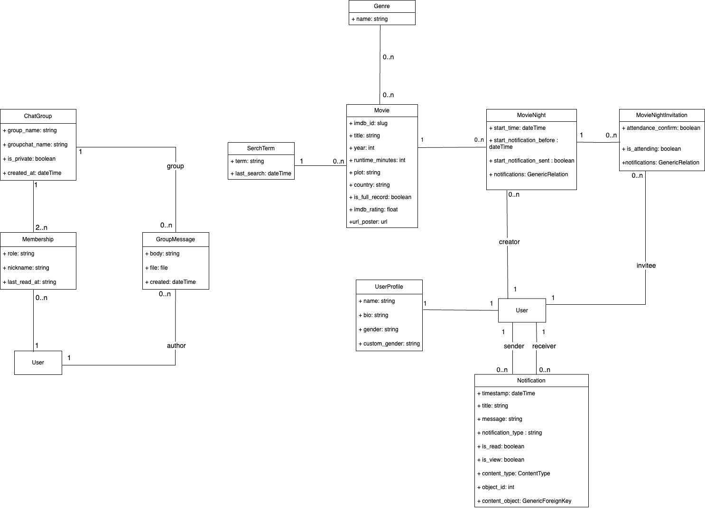

# Movie Night Together 

**Movie Night Together** is a full-stack web application designed to help friends and family organize movie nights effortlessly. Users can search for movies, create events, invite others, and receive notifications—all within a user-friendly interface.
**Movie Night UI - Frontend** access `https://github.com/nldq092203/Movie-Night-UI.git`
## Table of Contents

- [Features](#features)
  - [Backend Features](#backend-features)
  - [Frontend Features](#frontend-features)
- [Tech Stack](#tech-stack)
  - [Backend](#backend)
  - [Frontend](#frontend)
- [Database UML Diagram](#database-uml-diagram)
- [Installation and Usage](#installation-and-usage)
  - [Prerequisites](#prerequisites)
  - [Clone the Repository](#clone-the-repository)
  - [Environment Variables](#environment-variables)
  - [Docker Setup](#docker-setup)
- [Accessibility](#accessibility)
- [Docker Compose Configuration](#docker-compose-configuration)
- [API Documentation](#api-documentation)
- [Testing](#testing)
  - [Running Tests](#running-tests)
  - [Testing Tools](#testing-tools)
  - [Testing Components](#testing-components)
  - [Mocking External Services](#mocking-external-services)
- [Contact](#contact)
## Features

### Backend Features

- **User Authentication and Authorization**: Secure user registration and login using JWT tokens, with Google OAuth2 integration.
- **Movie Search**: Search for movies using the OMDb API and store them locally (48h update for a search).
- **Movie Details**: View comprehensive movie information, including genres, ratings, and full descriptions.
- **Movie Night Creation**: Organize movie nights and invite friends seamlessly.
- **Invitation Management**: Send, manage, and confirm invitations for movie nights.
- **Notifications**: Receive timely notifications via asynchronous tasks for:
  - **Upcoming Movie Night Reminders**: Get reminders before scheduled events.
  - **Start Time Updates**: Be informed of any changes to the event's start time.
  - **Cancellations**: Receive alerts if a movie night is canceled.
  - **New Invitations**: Get notified when you're invited to a movie night.
  - **Invitation Confirmations**: Hosts are notified when guests accept invitations.
- **Filtering and Sorting**: Easily filter and sort movies, events, and notifications.
- **Asynchronous Tasks**: Utilize Celery and Redis for handling background tasks and scheduled notifications.
- **Throttling and Pagination**: Efficient data handling with API usage control and paginated results.
- **CORS Support**: Cross-origin resource sharing enabled for broader accessibility.
- **API Documentation**: Comprehensive documentation generated with Swagger/OpenAPI.
- **TypeScript Support**: Custom types and interfaces for consistent data structures.

### Frontend Features

- **User Authentication**: Secure login and registration with JWT and Google OAuth2.
- **Form Validation**: Client-side validation for all forms to enhance user experience.
- **Movie Search and Details**: Intuitive interface for searching and viewing movie details.
- **Event Management**: Create and manage movie night events, send invitations, and handle notifications.
- **Responsive Design**: Optimized for all devices using React and Tailwind CSS.

## Tech Stack

### Backend

- **Frameworks**: Django, Django REST Framework (DRF)
- **Authentication**: Djoser, JWT, Google OAuth2
- **Asynchronous Tasks**: Celery, Redis
- **Database**: PostgreSQL (SQLite for development)
- **External APIs**: OMDb API
- **Documentation**: Swagger/OpenAPI
- **Testing**: Pytest, Factory Boy
- **Containerization**: Docker, Docker Compose
- **TypeScript**: For shared data structures and contracts

### Frontend

- **Framework**: React.js with TypeScript
- **Styling**: Tailwind CSS
- **State Management**: Redux (optional)
- **Routing**: React Router
- **HTTP Client**: Axios
- **Build Tool**: Vite

## Database UML Diagram
Below is the database UML diagram illustrating the data structure:


## Installation and Usage

### Prerequisites

- Docker & Docker Compose: Ensure both are installed on your system.

### Clone the Repository

```bash
https://github.com/nldq092203/Movie-Night.git
cd Movie-Night

```

### Environment Variables

```bash
# Django settings
SECRET_KEY=your_secret_key
DEBUG=True

# Database settings
POSTGRES_USER=your_postgres_user
POSTGRES_PASSWORD=your_postgres_password
POSTGRES_DB=your_postgres_db
DB_HOST = db
DB_PORT = 5432

# Redis settings
REDIS_URL=redis://redis:6379/0

# External API keys
OMDB_API_KEY=your_omdb_api_key
SOCIAL_AUTH_GOOGLE_OAUTH2_KEY=your_google_client_id
SOCIAL_AUTH_GOOGLE_OAUTH2_SECRET=your_google_client_secret
```

### Docker Setup

#### 1. Build and Start Containers:

```bash
docker-compose up --build

```

#### 2.Run Database Migrations (Optional)

```bash
docker-compose exec web python manage.py migrate

```

#### 3. Create a Superuser:

```bash
docker-compose exec web python manage.py createsuperuser
```

#### 4. Stop the application
```bash
docker-compose down
```

## Accessibility

- Visit `http://localhost:8000/` to access the application.
- Admin interface at `http://localhost:8000/admin/`.
- Frontend Application: Accessible at `http://localhost:5173/`


## Docker Compose Configuration
The docker-compose.yml file includes services for:

- **web: The Django application.**
- **db: PostgreSQL database.**
- **redis: Redis server for Celery.**
- **celery: Celery worker for asynchronous tasks.**
- **celery-beat: Celery Beat scheduler for periodic tasks.**
- **frontend: The React frontend application.**    

## API Documentation

The API is documented using Swagger/OpenAPI.
Swagger UI: Accessible at `http://localhost:8000/api/schema/swagger-ui`.

### Generating API Schema

```bash
python manage.py spectacular --file schema.yaml

```

### Generating TypeScript Types (Optional)

```bash
npx openapi-typescript schema.yaml --output types.ts

```

## Testing

### Running Tests

```bash
docker-compose exec web pytest
```

### Testing Tools

- **Pytest**: Testing framework.
- **Factory Boy**: For creating test data.
- **APIClient**: To simulate API requests in tests.

### Testing Components

- **Models**: Test the integrity and behavior of models.
- **Views and APIs**: Test API endpoints, permissions, filters, and pagination.
- **Tasks**: Test Celery tasks and scheduled jobs.
- **Serializers**: Ensure data serialization and deserialization works as expected.
- **URLs**: Test that all routes are correctly mapped and accessible, and that they return the expected responses. 

### Mocking External Services

Use mocking to simulate external API calls (e.g., OMDb API) during tests to avoid hitting real endpoints.

## Contact

- **Author**: NGUYEN Le Diem Quynh
- **Email**: lnguye220903@gmail.com
- **GitHub**: nldq092203
