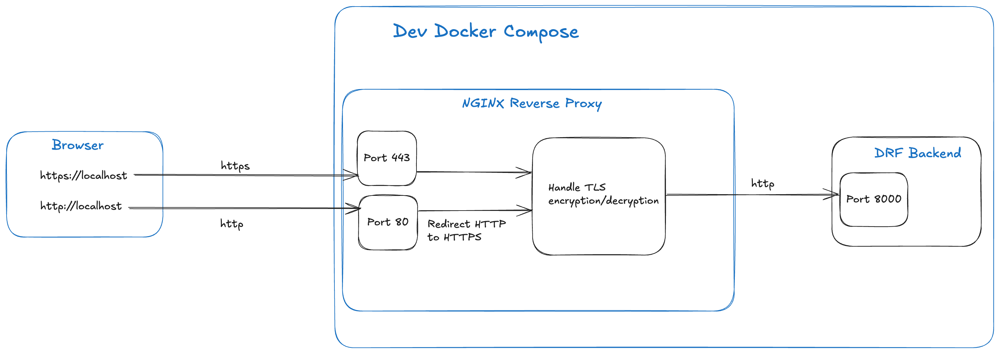
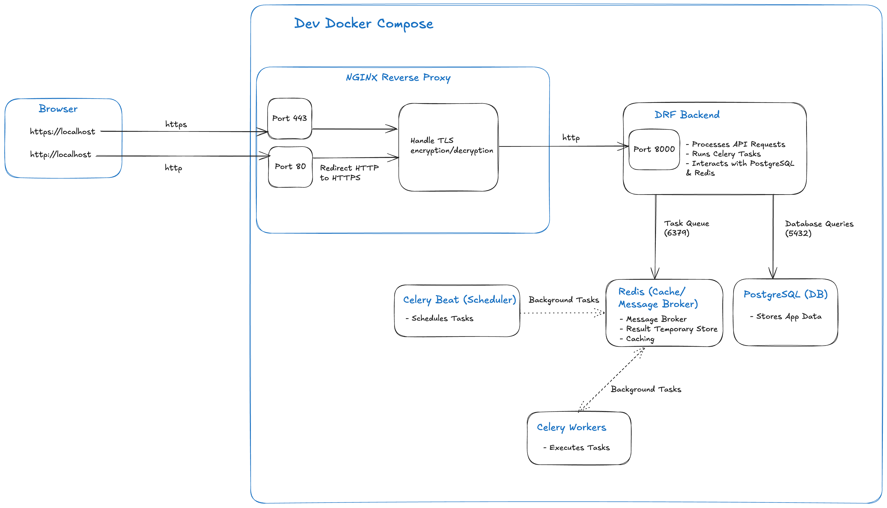

# Movie Night Together 


***Movie Night Together*** is a full-stack web application designed as a social platform to simplify organizing movie night events. With Movie Night Together, users can effortlessly search for movies, create and manage events, invite friends, receive notifications, and chat individually or in groups—all within an intuitive and user-friendly interface.

## Demo Video

https://github.com/user-attachments/assets/8008ab6c-32e1-408b-ac73-dc68ba332a6d


## Table of Contents

- [Features](#features)
- [Tech Stack](#tech-stack)
  - [Backend](#backend)
  - [Frontend](#frontend)
  - [Infrastructure](#infrastructure)
  - [CI/CD](#ci/cd)
- [Accessibility](#accessibility)
- [Database UML Diagram](#database-uml-diagram)
- [HTTPS Configuration Schema](#https-configuration-schema)
- [Project Development Architecture](#project-development-architecture)
- [Development](#development)
  - [Centralized Scripts: Installation and Usage Guide](#installation-and-usage)
    - [Clone the Repository](#clone-the-repository)
	- [Usage Guide](#usage-guide)
  - [API Documentation](#api-documentation)
  - [Testing](#testing)
    - [Running Tests](#running-tests)
    - [Testing Tools](#testing-tools)
    - [Testing Components](#testing-components)
    - [Mocking External Services](#mocking-external-services)

- [Contact](#contact)

## Accessibility

- Visit [Project Website](https://movienight-ui-550865855378.europe-west9.run.app) to access the live application.
- Visit [Movie-Night-UI](https://github.com/nldq092203/Movie-Night-UI.git) to access Frontend project.

## Features

🔐 User Authentication and Authorization

	•	JWT Authentication: Secure login and registration with JSON Web Tokens (JWT) for session management.
	•	Google OAuth2 Integration: Simplified login with Google accounts for faster access.

🕒 Asynchronous Tasks

	•	Background Processing with Celery and Redis: Offload heavy operations and enable scheduled notifications using Celery and Redis.

🔄 Real-Time Chat with WebSockets

	•	Instant Messaging: Real-time chatbox to communicate instantly with other users, powered by WebSocket technology.

🎥 Movie Management

	•	Movie Search: Search movies using the OMDb API, and store data locally for quicker future access.
	•	Detailed Movie Pages: View extensive details, including genres, ratings, and descriptions.

🎬 Movie Night Event Organization

	•	Create and Manage Events: Organize and manage movie nights, including scheduling, invite management, and start time updates.
	•	Invitation System: Send, manage, and confirm invitations for movie nights with real-time updates.
  
🎬 Event Notifications

	•	Reminders: Stay updated with timely reminders before your upcoming movie nights.
	•	Event Updates: Instantly notified of start time adjustments or event cancellations.
	•	New Invitations: Receive alerts when you’re invited to new movie nights.
	•	Invitation Confirmations: As a host, get notified when invitees confirm their attendance.

💬 Chatbox Features

	•	Private and Group Chat Creation: Easily set up chat groups for private or public discussions.
	•	Nickname Customization: Assign nicknames in group chats for personalized interactions.
	•	Message Search: Search messages and chatbox names to quickly locate conversations.

👤 User Profile Management

	•	Profile Customization: Update your avatar, name, gender, bio, and manage your personal event schedule.

🔎 Advanced Filtering and Sorting

	•	Enhanced Data Navigation: Filter and sort data across movies, events, notifications, chat groups, and messages for a tailored user experience.

📊 API Throttling, Pagination, and Caching

	•	Efficient Data Handling: Control API usage and retrieve data in paginated results to optimize load times and performance.
	•	Redis Cache Integration: Frequently accessed data like movie and search results are cached to improve response times and reduce database load.

🛠 Performance Monitoring with Django Debug Tool

	•	Detailed analysis of database queries and cache performance.
	•	Helps identify and resolve bottlenecks, ensuring optimal application efficiency.

🌍 CORS Support

	•	Cross-Origin Resource Sharing: Safely enable cross-origin access for broader accessibility to your application.

📄 Comprehensive API Documentation

	•	Swagger/OpenAPI Documentation: Easily reference API endpoints, request parameters, and responses with well-organized documentation.

⚙️ TypeScript Support

	•	Static Typing: Utilize custom types and interfaces for robust, consistent data structures and improved code quality.

## Tech Stack
### Backend
- **Frameworks**: Django, Django REST Framework (DRF)
- **Authentication**: Djoser, JWT, Google OAuth2
- **Web Socket**: Ably (third party)
- **Asynchronous and Scheduled Tasks**: Celery, Redis
- **In-memory caching**: Redis
- **Performance Monitoring**: Django Debug Tool 
- **Database**: PostgreSQL (SQLite for test)
- **Testing**: Pytest, Factory Boy, APIClient, Postman
- **Cloud Storage**: Firebase
- **External APIs**: OMDb API
- **Documentation**: Swagger/OpenAPI 
- **Containerization**: Docker, Docker Compose
- **TypeScript**: For shared data structures and contracts

### Frontend

- **Framework**: React.js 
- **Styling**: Tailwind CSS
- **Routing**: React Router
- **HTTP Client**: Axios
- **Build Tool**: Vite

### Infrastructure

- **NGINX Reverse Proxy**: Secure and efficient request management.
- **HTTPS/TLS Certificates**: Self-signed for development; production-ready for deployment.
- **Containerization**: Docker, Docker Compose

### CI/CD
- **Source Control**: GitHub
- **CI/CD Pipeline**: Github Action
- **Deployment**: Google Cloud Run, Railway
## Database UML Diagram
Below is the database UML diagram illustrating the data structure:


## HTTPS Configuration Schema
Below is a detailed schema illustrating how HTTPS is configured using NGINX as a reverse proxy in the project, including TLS encryption and HTTP to HTTPS redirection:


## Project Development Architecture
Below is a comprehensive schema showcasing the overall development architecture of the project, highlighting the integration of NGINX reverse proxy, Celery, Redis, PostgreSQL, and the Django backend within a Docker Compose:


## Development
### Installation and Usage
The project includes a centralized script, run.sh, located in the infrastructure/scripts/ directory. This script simplifies the setup and management of the development environment.

#### Clone the Repository
##### Backend Repo
```bash
git clone https://github.com/nldq092203/Movie-Night.git
cd Movie-Night

```

##### Frontend Repo
```bash
git clone https://github.com/nldq092203/Movie-Night-UI.git
cd Movie-Night-UI
```
#### Usage Guide
##### View All Commands
To view all available commands for the centralized run.sh script, run:
``` bash
./infrastructure/scripts/run.sh help
```

##### Start the Development Environment
``` bash
./infrastructure/scripts/run.sh dev
```

##### Generate TLS Certificates
``` bash
./infrastructure/scripts/run.sh create-tls-certs
```

##### Add TLS Certificates to Trusted Store
Ensure that the self-signed certificate is recognized as valid by your system, eliminating browser security warnings for HTTPS connections
``` bash
./infrastructure/scripts/run.sh add-trusted-cert
```

##### View Logs for a Specific Service
``` bash
./infrastructure/scripts/run.sh logs
```

##### Execute Commands in a Service
Run a shell command in a specific container (e.g., web):
``` bash
./infrastructure/scripts/run.sh exec
```

For more detailed commands and options, refer to the script itself
``` bash
cat ./infrastructure/scripts/run.sh
```

### API Documentation

The API is documented using Swagger/OpenAPI: [Swagger UI](https://web-production-5212b.up.railway.app/api/schema/swagger-ui/)


#### Generating API Schema

```bash
python3 manage.py spectacular --file schema.yaml

```

#### Generating TypeScript Types (Optional)

```bash
npx openapi-typescript schema.yaml --output types.ts

```

### Testing

#### Running Tests
To run the tests for your Django project within the Docker container, follow these steps:

1. Choose the web service when prompted.
2. Use the following command to start the process:
```bash
./infrastructure/scripts/run.sh exec
```
After running the command, select the web service by entering its corresponding number and proceed to execute:
```bash
pytest
```

#### Testing Tools

- **Pytest**: Testing framework.
- **Factory Boy**: For creating test data.
- **APIClient**: To simulate API requests in tests.

#### Testing Components

- **Models**: Test the integrity and behavior of models.
- **Views and APIs**: Test API endpoints, permissions, filters, and pagination.
- **Tasks**: Test Celery tasks and scheduled jobs.
- **Serializers**: Ensure data serialization and deserialization works as expected.
- **URLs**: Test that all routes are correctly mapped and accessible, and that they return the expected responses. 

#### Mocking External Services

Use mocking to simulate external API calls (e.g., OMDb API) during tests to avoid hitting real endpoints.

## Contact

- **Author**: NGUYEN Le Diem Quynh
- **Email**: lnguye220903@gmail.com
- **GitHub**: nldq092203
